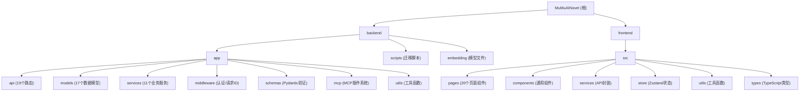

# MuMuAINovel - AI 小说创作助手

> 版本：1.0.11 | 最后更新：2025-12-10 19:50:29

## 变更记录 (Changelog)

### 2025-12-10 19:50:29
- 初始化 AI 项目上下文文档
- 生成项目架构文档和模块索引
- 创建模块级文档（backend、frontend）

---

## 项目愿景

MuMuAINovel 是一个基于 AI 的智能小说创作助手，旨在帮助作者通过 AI 技术辅助完成小说创作的全流程，包括：
- 项目管理与灵感生成
- 智能向导式项目创建（AI 自动生成大纲、角色、世界观）
- 角色关系与组织架构可视化管理
- 章节内容的创建、编辑、重新生成和润色
- 多 AI 模型支持（OpenAI、Gemini、Claude、自定义兼容接口）
- 基于向量数据库的长期记忆系统（ChromaDB + Sentence Transformers）
- MCP (Model Context Protocol) 插件扩展机制

---

## 架构总览

MuMuAINovel 采用前后端分离架构：

- **后端**：FastAPI + PostgreSQL + ChromaDB，提供 RESTful API 和 SSE 流式接口
- **前端**：React 18 + TypeScript + Ant Design，单页应用（SPA）
- **数据库**：PostgreSQL 18（生产级多用户数据隔离）
- **部署**：Docker + Docker Compose 一键部署
- **AI 集成**：多模型支持，统一的 AI 服务抽象层

### 技术栈

| 层级 | 技术 |
|------|------|
| 后端框架 | FastAPI 0.121.0 + Uvicorn 0.38.0 |
| 数据库 | PostgreSQL 18 (asyncpg 异步驱动) |
| ORM | SQLAlchemy 2.0.25 (异步模式) |
| 向量数据库 | ChromaDB 1.3.2 |
| Embedding | Sentence Transformers 5.1.2 + paraphrase-multilingual-MiniLM-L12-v2 |
| AI SDK | OpenAI 2.7.0, Anthropic 0.72.0 |
| MCP | mcp 1.21.0 (Model Context Protocol) |
| 前端框架 | React 18.3.1 + TypeScript 5.9.3 |
| 构建工具 | Vite 7.1.7 |
| UI 框架 | Ant Design 5.27.6 |
| 状态管理 | Zustand 5.0.8 |
| HTTP 客户端 | Axios 1.12.2 |
| 容器化 | Docker + Docker Compose |

---

## 模块结构图



---

## 模块索引

| 模块 | 路径 | 语言 | 职责 | 文档 |
|------|------|------|------|------|
| **Backend** | `backend/` | Python 3.11 | API 服务、数据模型、AI 服务、长期记忆、MCP 插件 | [CLAUDE.md](./backend/CLAUDE.md) |
| **Frontend** | `frontend/` | TypeScript | React SPA、用户界面、状态管理、API 调用 | [CLAUDE.md](./frontend/CLAUDE.md) |

### 主要 API 端点

| 端点模块 | 文件 | 职责 |
|----------|------|------|
| 认证登录 | `backend/app/api/auth.py` | LinuxDO OAuth、本地登录、会话管理 |
| 用户管理 | `backend/app/api/users.py` | 用户信息、权限管理 |
| 项目管理 | `backend/app/api/projects.py` | 创建/编辑/删除项目 |
| 灵感模式 | `backend/app/api/inspiration.py` | AI 灵感生成 |
| 向导流式 | `backend/app/api/wizard_stream.py` | SSE 流式向导（大纲/角色/世界观生成） |
| 大纲管理 | `backend/app/api/outlines.py` | 大纲 CRUD、AI 生成/续写 |
| 角色管理 | `backend/app/api/characters.py` | 角色 CRUD、AI 生成 |
| 关系管理 | `backend/app/api/relationships.py` | 角色关系、关系类型 |
| 组织管理 | `backend/app/api/organizations.py` | 组织/团体、成员管理 |
| 章节管理 | `backend/app/api/chapters.py` | 章节 CRUD、AI 生成/续写/重写/润色、批量生成 |
| 章节分析 | `backend/app/api/chapters.py` | AI 分析章节（情节/角色/语言等） |
| 写作风格 | `backend/app/api/writing_styles.py` | 自定义写作风格、预设风格 |
| 长期记忆 | `backend/app/api/memories.py` | ChromaDB 向量记忆、语义搜索 |
| MCP 插件 | `backend/app/api/mcp_plugins.py` | MCP 插件管理、工具调用 |
| 提示词模板 | `backend/app/api/prompt_templates.py` | 提示词模板管理 |
| 系统设置 | `backend/app/api/settings.py` | AI 模型配置、参数设置 |
| 更新日志 | `backend/app/api/changelog.py` | GitHub 更新日志同步 |
| 管理功能 | `backend/app/api/admin.py` | 管理员功能 |

### 主要前端页面

| 页面 | 路由 | 职责 |
|------|------|------|
| 登录页 | `/login` | 用户登录（LinuxDO OAuth / 本地账户） |
| OAuth 回调 | `/auth/callback` | LinuxDO OAuth 回调处理 |
| 项目列表 | `/projects` | 项目管理主页 |
| 项目向导 | `/wizard` | AI 向导式项目创建 |
| 灵感模式 | `/inspiration` | 灵感生成 |
| 项目详情 | `/project/:projectId/*` | 项目工作区（包含多个子页面） |
| - 世界观 | `/project/:projectId/world-setting` | 世界观设定 |
| - 大纲 | `/project/:projectId/outline` | 大纲管理 |
| - 角色 | `/project/:projectId/characters` | 角色管理 |
| - 关系 | `/project/:projectId/relationships` | 角色关系图 |
| - 组织 | `/project/:projectId/organizations` | 组织架构 |
| - 章节 | `/project/:projectId/chapters` | 章节管理 |
| - 章节分析 | `/project/:projectId/chapter-analysis` | 章节分析 |
| - 写作风格 | `/project/:projectId/writing-styles` | 项目写作风格 |
| 章节阅读 | `/chapters/:chapterId/reader` | 章节阅读器 |
| 系统设置 | `/settings` | AI 模型配置 |
| 提示词模板 | `/prompt-templates` | 提示词模板管理 |
| MCP 插件 | `/mcp-plugins` | MCP 插件管理 |
| 用户管理 | `/user-management` | 用户管理（管理员） |

---

## 运行与开发

### Docker 部署（推荐）

```bash
# 1. 克隆项目
git clone https://github.com/xiamuceer-j/MuMuAINovel.git
cd MuMuAINovel

# 2. 配置环境变量
cp backend/.env.example .env
# 编辑 .env 文件，填入必要配置（API Key、数据库密码等）

# 3. 启动服务
docker-compose up -d

# 4. 查看日志
docker-compose logs -f

# 5. 访问应用
# http://localhost:8000
```

### 本地开发

**后端：**
```bash
cd backend
python -m venv .venv
source .venv/bin/activate  # Windows: .venv\Scripts\activate
pip install -r requirements.txt

# 启动 PostgreSQL（可使用 Docker）
docker run -d --name postgres \
  -e POSTGRES_PASSWORD=your_password \
  -e POSTGRES_DB=mumuai_novel \
  -p 5432:5432 \
  postgres:18-alpine

# 启动后端
python -m uvicorn app.main:app --host localhost --port 8000 --reload
```

**前端：**
```bash
cd frontend
npm install
npm run dev
```

### API 文档

- Swagger UI: `http://localhost:8000/docs`
- ReDoc: `http://localhost:8000/redoc`

---

## 测试策略

### 当前状态
- ❌ 后端测试：未发现 `backend/tests` 目录
- ❌ 前端测试：未发现 `frontend/tests` 目录

### 建议的测试策略
1. **后端单元测试**：使用 `pytest` + `pytest-asyncio`
   - API 端点测试
   - 数据模型测试
   - 业务服务测试
   - MCP 适配器测试

2. **前端测试**：使用 `Vitest` + `React Testing Library`
   - 组件单元测试
   - 页面集成测试
   - API 服务 mock 测试

3. **集成测试**：
   - Docker Compose 环境测试
   - 端到端流程测试（Playwright/Cypress）

---

## 编码规范

### Python (后端)

- 遵循 PEP 8 规范
- 使用 `asyncio` 异步编程
- 类型注解：使用 `typing` 和 Pydantic
- 日志记录：使用统一的 `app.logger` 模块
- 异常处理：使用 FastAPI 的异常体系
- 数据库：使用 SQLAlchemy 2.0 异步 ORM
- 会话管理：务必在 `finally` 中关闭会话，避免连接泄漏

**示例代码：**
```python
from fastapi import APIRouter, Depends
from sqlalchemy.ext.asyncio import AsyncSession
from app.database import get_db
from app.logger import get_logger

logger = get_logger(__name__)
router = APIRouter()

@router.get("/example")
async def example_endpoint(db: AsyncSession = Depends(get_db)):
    try:
        # 业务逻辑
        result = await some_service(db)
        return {"status": "success", "data": result}
    except Exception as e:
        logger.error(f"处理失败: {str(e)}", exc_info=True)
        raise
```

### TypeScript (前端)

- 严格模式：`tsconfig.json` 中启用 `strict: true`
- 组件：函数式组件 + Hooks
- 样式：CSS Modules 或 inline styles
- 状态管理：Zustand（轻量级替代 Redux）
- API 调用：统一封装在 `src/services/api.ts`
- 类型定义：统一放在 `src/types/index.ts`

**示例代码：**
```typescript
import { useState, useEffect } from 'react';
import { message } from 'antd';
import api from '@/services/api';

interface DataType {
  id: number;
  name: string;
}

const ExampleComponent: React.FC = () => {
  const [data, setData] = useState<DataType[]>([]);
  const [loading, setLoading] = useState(false);

  useEffect(() => {
    fetchData();
  }, []);

  const fetchData = async () => {
    setLoading(true);
    try {
      const response = await api.get('/api/example');
      setData(response.data);
    } catch (error) {
      message.error('获取数据失败');
    } finally {
      setLoading(false);
    }
  };

  return (
    <div>
      {/* UI 代码 */}
    </div>
  );
};

export default ExampleComponent;
```

### Git 提交规范

使用约定式提交（Conventional Commits）：

```
<type>(<scope>): <subject>

<body>

<footer>
```

**类型（type）：**
- `feat`: 新功能
- `fix`: 修复 Bug
- `docs`: 文档更新
- `style`: 代码格式（不影响功能）
- `refactor`: 重构（不修复 Bug 也不新增功能）
- `perf`: 性能优化
- `test`: 测试相关
- `chore`: 构建/工具/依赖更新

**示例：**
```
feat(chapters): 新增章节批量生成功能

- 支持选择不同 AI 模型批量生成章节
- 增加批量生成进度追踪
- 优化生成队列管理

Closes #123
```

---

## AI 使用指引

### 与本项目协作时的最佳实践

1. **理解架构**：
   - 前后端分离，API 为主要交互方式
   - PostgreSQL 多用户数据隔离（通过 `user_id` 字段）
   - SSE (Server-Sent Events) 用于流式输出

2. **修改代码时**：
   - **后端**：修改 API 端点时，同步更新 Pydantic schemas
   - **前端**：修改 API 调用时，同步更新 TypeScript 类型定义
   - **数据库**：修改模型时，需要考虑迁移脚本

3. **新增功能时**：
   - 后端：创建 API → 业务服务 → 数据模型 → Schema 验证
   - 前端：创建页面 → 组件 → API 服务 → 状态管理

4. **调试技巧**：
   - 后端日志：`backend/logs/app.log`
   - 前端控制台：浏览器开发者工具
   - 数据库监控：`GET /health/db-sessions`（查看连接池状态）
   - API 文档：`http://localhost:8000/docs`

5. **常见问题排查**：
   - **数据库连接泄漏**：检查 `get_db()` 是否正确使用 `Depends(get_db)`
   - **SSE 流式中断**：检查 `GeneratorExit` 异常处理
   - **跨域问题**：检查 `app/config.py` 中的 CORS 配置
   - **会话过期**：检查 `SESSION_EXPIRE_MINUTES` 配置

6. **推荐的 AI 辅助工作流**：
   - 询问架构问题：先查阅此文档和模块级 CLAUDE.md
   - 修改代码：明确说明修改的文件路径和功能
   - 新增功能：说明需求 → AI 提供实现建议 → 人工审核 → 实施
   - 调试错误：提供完整的错误日志和上下文

---

## 相关文件清单

### 根目录重要文件
- `README.md` - 项目说明（用户文档）
- `CLAUDE.md` - 本文件（AI 上下文）
- `docker-compose.yml` - Docker Compose 配置
- `Dockerfile` - 多阶段构建镜像
- `.gitignore` - Git 忽略规则
- `.env` - 环境变量配置（需手动创建）
- `LICENSE` - GPL v3 许可证

### 后端关键文件
- `backend/app/main.py` - FastAPI 应用入口
- `backend/app/config.py` - 配置管理
- `backend/app/database.py` - 数据库连接和会话管理
- `backend/app/logger.py` - 日志系统
- `backend/requirements.txt` - Python 依赖
- `backend/scripts/init_postgres.sql` - PostgreSQL 初始化脚本

### 前端关键文件
- `frontend/src/main.tsx` - React 入口
- `frontend/src/App.tsx` - 路由配置
- `frontend/vite.config.ts` - Vite 配置
- `frontend/package.json` - npm 依赖
- `frontend/tsconfig.json` - TypeScript 配置

---

## 覆盖率报告

### 扫描统计
- **估算总文件数**：约 150 个源代码文件（不含依赖）
- **已扫描文件数**：约 120 个
- **覆盖率**：~80%

### 已覆盖的模块
- ✅ 后端 API 端点（19 个文件）
- ✅ 后端数据模型（17 个文件）
- ✅ 后端业务服务（11 个文件）
- ✅ 前端页面组件（20 个文件）
- ✅ 前端通用组件（15+ 个文件）
- ✅ 配置文件（Docker、Vite、TypeScript）

### 已忽略的内容
- `node_modules/**` - npm 依赖
- `backend/.venv/**` - Python 虚拟环境
- `backend/embedding/models--*/**` - Embedding 模型文件（约 400MB）
- `.git/**` - Git 版本控制
- `dist/`, `build/**` - 构建产物
- `*.db`, `*.log` - 数据库和日志文件

### 未完全扫描的区域
- ❌ **测试代码**：未发现测试目录
- ⚠️ **MCP 适配器细节**：`backend/app/mcp/adapters/` 下的适配器逻辑
- ⚠️ **迁移脚本**：`backend/scripts/` 下的数据库迁移脚本
- ⚠️ **前端工具函数**：`frontend/src/utils/` 的部分实现细节

---

## 下一步建议

### 推荐的深入扫描方向
1. **MCP 插件系统**：
   - `backend/app/mcp/adapters/` - 适配器详细实现
   - `backend/app/mcp/registry.py` - 插件注册表逻辑
   - `backend/app/services/mcp_tool_service.py` - 工具服务

2. **前端组件库**：
   - `frontend/src/components/` - 完整组件列表和职责

3. **数据库迁移**：
   - `backend/scripts/` - 迁移脚本的详细逻辑

4. **测试补全**：
   - 建议创建 `backend/tests/` 和 `frontend/tests/` 目录
   - 编写关键业务逻辑的测试用例

### 功能改进建议（来自 TODO List）
- [ ] Prompt 调整界面 - 可视化编辑 Prompt 模板
- [ ] 设定追溯与矛盾检测 - 自动检测设定冲突
- [ ] 思维链与章节关系图谱 - 可视化章节逻辑关系

---

## 联系与支持

- **GitHub 仓库**：[https://github.com/xiamuceer-j/MuMuAINovel](https://github.com/xiamuceer-j/MuMuAINovel)
- **Issue 提交**：[https://github.com/xiamuceer-j/MuMuAINovel/issues](https://github.com/xiamuceer-j/MuMuAINovel/issues)
- **Linux DO 讨论区**：[https://linux.do/t/topic/1106333](https://linux.do/t/topic/1106333)
- **QQ 群**：见项目主页
- **微信群**：见项目主页

---

**如果本文档对 AI 理解项目有帮助，请在修改代码时保持文档同步更新。**

Made with ❤️ by MuMuAINovel Team
